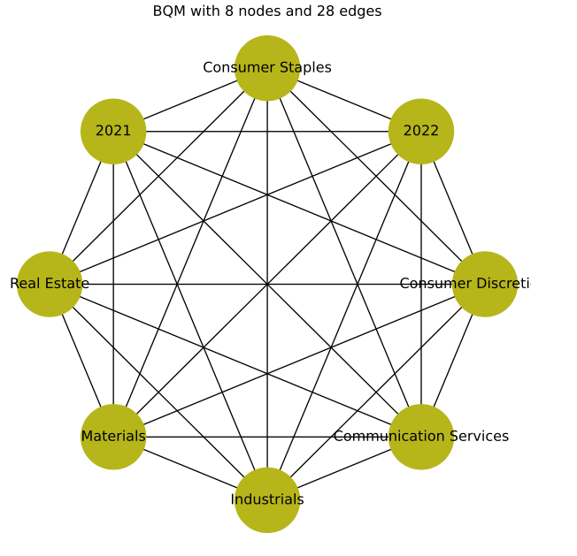
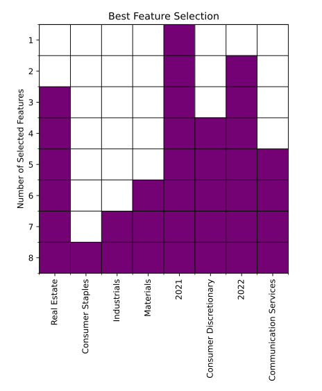

# Application of Mutual Information QUBO for Feature Selection

## Abstract
This research explores the utilization of mutual information and Quadratic Unconstrained Binary Optimization (QUBO) on the D-wave quantum computer to predict the top-performing sectors in the S&P 500. Leveraging mutual information for feature selection, this study identifies the shared information between the Sharpe ratio in the sector and the S&P 500 index. The data consists of daily price data spanning three years from 2020 to 2022. The derived mutual information matrix is transformed into a QUBO problem, which the D-wave quantum computer solves using its quantum annealing algorithm. Experimental outcomes validate the accuracy of the mutual information QUBO method, revealing a significant correlation between the predicted and actual returns.

## Table of Contents

- [Introduction](#introduction)
- [QUBO Representation of Feature Selection](#qubo-representation)
- [Application](#application)
- [Results](#results)
- [Acknowledgments](#acknowledgments)

## Introduction
Selecting the right features is crucial when building a machine learning model. Mutual information stands out as an essential technique to sift through high-dimensional data and enhance the machine learning model's performance.

### Pre-processing
The model's performance often dwindles with the inclusion of redundant or irrelevant features. Feature selection emerges as a pivotal preprocessing step, enabling data set simplification by recognizing the most crucial variables and negating collinear variables.

### Mutual Information
In feature selection, mutual information gauges the dependence between a feature and the target variable. A greater mutual information between a feature and the target translates to a higher relevance of that feature in predicting the target variable.

## QUBO Representation of Feature Selection
Traditionally, QUBO problems find their roots in computer science, primarily focusing on binary variables. The Mutual Information QUBO (MIQUBO) method reimagines feature selection, aiming to optimize the selection of features to maximize mutual information.

## Application
Employing MIQUBO for feature selection on the S&P 500 index seeks to pinpoint the ideal feature set for anticipating the top performance of the 11 GICS sectors. The data originates from Yahoo Finance's daily price data over three years, from 2020 to 2022, and has been feature-engineered to spotlight the top 5 over-performing and underperforming sectors, as determined by their respective Sharpe ratios.

After identifying the features that possess the highest mutual information with the Sharpe ratio, the top 8 ranking features are embedded onto the system's Quantum Processing Unit (QPU) topology, crucial for solving a BQM problem on a D-Wave system.

## Results
Once configured, the D-Wave 2000Q QPU proceeds to solve the BQM for the selected 8 features. The consequent plot showcases the best features out of the chosen set.

